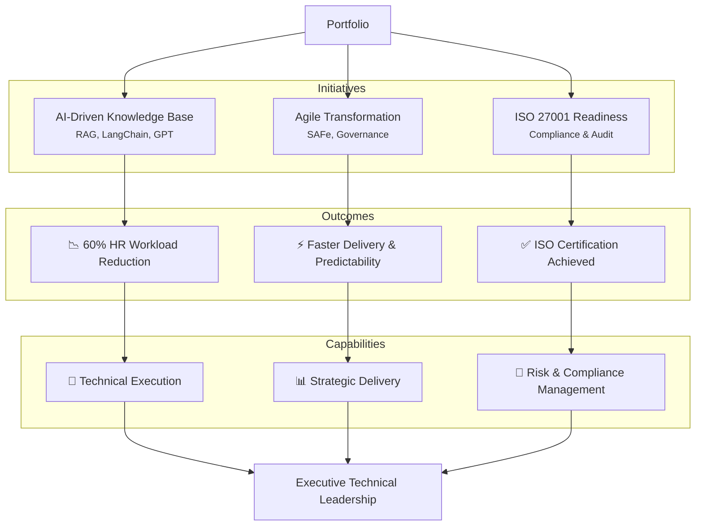

# Portfolio Summary

As a senior technology leader with 25+ years of experience, my portfolio showcases enterprise-scale innovations across Agile transformation, AI architecture, and information security compliance—highlighting a trajectory toward the Technical Executive role. Each case study reflects my ability to blend strategic vision with hands-on technical execution.

---

## Key Highlights

-  AI-Driven Innovation  
  Architected an enterprise-grade AI knowledge base using **Retrieval-Augmented Generation (RAG)** with OpenAI, LangChain, Flask, and Azure Cognitive Search.  
  ✅ Automated HR query handling, reducing operational workload by **over 60%**.

-  Enterprise Agile Transformation  
  Led multi-team Agile scaling initiatives at Capital One, embedding SAFe practices and engineering governance.  
  ✅ Improved delivery predictability and reduced cycle time across product teams.

-  ISO 27001 Certification Readiness  
  Directed a full ISO 27001 audit and certification program, aligning IT and business with enterprise risk frameworks.  
  ✅ Established repeatable compliance governance models.

---

## What This Portfolio Demonstrates

- Proven ability to deliver strategic technical outcomes aligned with business goals  
- Deep expertise in AI/ML, Cloud, Agile at Scale, Risk & Compliance  
- Cross-functional leadership and executive collaboration  
- Technical fluency in modern development stacks, DevOps, and secure architecture

---

## Case studies (in this repo)

| Initiative | Summary |
|------------|---------|
| [AI-Driven HR Knowledge Base (RAG)](ai-hr-chatbot/) | Enterprise RAG chatbot with OpenAI, LangChain, Azure Cognitive Search — 60% HR workload reduction. |
| [Enterprise Agile Transformation at Scale](Enterprise%20Agile%20Transformation%20at%20Scale/) | SAFe, capacity planning, and delivery governance at Capital One Card Tech. |
| [ISO 27001 Certification Initiative](ISO%2027001%20Certification%20Initiative/) | Full audit-readiness program, Risk Control Board, ISMS alignment — certification in under 9 months. |
| [SQL Practice Platform](SQL%20Practice%20Platform/) | Full-stack SQL practice tests: AI-generated questions (OpenAI), schema-once UX, SQL Runner, auto-review. |
| [Student Companion](Student%20Companion/) | Academic workflow platform: documents, study assistant, notes, email, OFAC compliance, voice assistant. |
| [Turnify AI B2B Portal](Turnify%20AI%20B2B%20Portal/) | B2B returns and order portal mockup: return requests, order tracking, analytics, RBAC, real-time updates. |
| [SSBS Website](SSBS%20Website/) | Professional site for SSB Solutions LLC: AI, Data, and Agile consulting; React, Framer Motion, mobile-first. |
| [Utsav-Events.com](Utsav-Events.com/) | Invite & RSVP app for events: shareable link, host view, Excel/JSON download, Supabase or local storage. |

---

## Writing & articles

| Article | Description |
|--------|--------------|
| [From PoC to Real-World AI: Secure and Governable AI at Scale](WritingArticlesPlatform/Articles/article-poc-to-prod-secure-governed-ai.html) | Building secure, compliant, and governed AI at scale—from experimentation to enterprise. |

---

## GitHub repos & latest work

| Repo | Description | Live / link |
|------|-------------|-------------|
| [executive-tech-portfolio](https://github.com/CSkarki/executive-tech-portfolio) | This portfolio: case studies, articles, and technical leadership work. | — |
| [Utsav-Events.com](https://github.com/CSkarki/PartyShaarty) | Invite & RSVP app for events (Utsav-Events.com). | [Utsav-Events.com (Vercel)](https://party-shaarty.vercel.app) |
| [sql-practice-platform](https://github.com/CSkarki/sql-practice-platform) | SQL practice platform. | [SQL Practice (Vercel)](https://sql-practice-platform.vercel.app) |
| [ssbs-website](https://github.com/CSkarki/ssbs-website) | SSBS website. | [SSBS (Vercel)](https://ssbs-website.vercel.app) |
| [studentcompanion](https://github.com/CSkarki/studentcompanion) | Student companion app. | [Student Companion (Vercel)](https://studentcompanion.vercel.app) |
| [turnify-ai-b2b-portal-Mockup](https://github.com/CSkarki/turnify-ai-b2b-portal-Mockup) | Turnify AI B2B portal — mockup/demo. | [Turnify (Vercel)](https://turnify-ai-b2b-portal.vercel.app) |

---

## Portfolio Map

---

